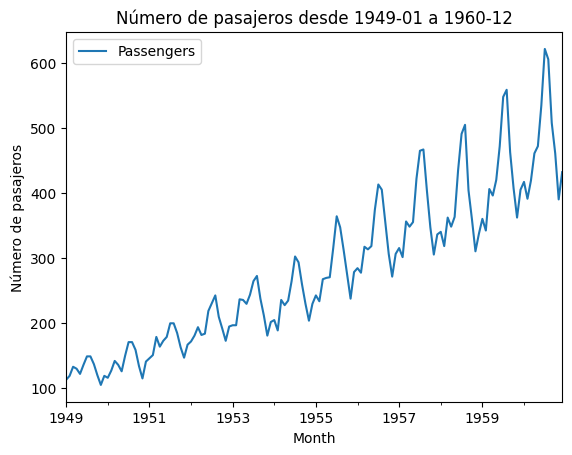
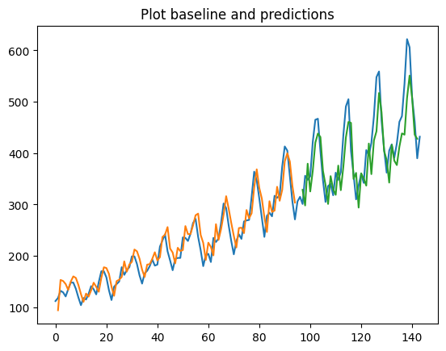

<a href="https://colab.research.google.com/github/ayrna/ap-ts-rnn/blob/main/redes_recurrentes/time_series_data.ipynb" target="_parent"></a>

# Utilizar Keras para construir y entrenar redes LSTM con series temporales

En este cuaderno, vamos a usar keras para construir una red LSTM que resuelva un problema de predicción en series temporales.

El problema que vamos a estudiar es el de predicción de pasajeros de líneas aéreas internacionales. Para este problema se nos da un año y un mes y tenemos que predecir el número de pasajeros de líneas aéreas internacionales en unidades de 1.000. En otras palabras, tenemos que responder a la pregunta: "Dado el número de pasajeros (en unidades de miles) de este mes, ¿cuál será el número de pasajeros del próximo mes?".

Los datos van de enero de 1949 a diciembre de 1960 con 144 observaciones.


```python
import tensorflow as tf
from tensorflow import keras

import numpy
import matplotlib.pyplot as plt
import pandas as pd
import math

from tensorflow.keras.utils import to_categorical
from tensorflow.keras.models import Sequential
from tensorflow.keras.layers import LSTM, Dense, Dropout, InputLayer

from sklearn.preprocessing import MinMaxScaler
from sklearn.metrics import mean_squared_error
```

El siguiente paso es cargar nuestro conjunto de datos de entrenamiento como un `DataFrame` de Pandas. A continuación, podemos extraer la matriz `numpy` del `DataFrame` y convertir los valores enteros en valores de punto flotante, que son más adecuados para el modelado con una red neuronal.


```python
# Cargar el conjunto de datos usando pandas
try:
    url = "https://raw.githubusercontent.com/jbrownlee/Datasets/master/airline-passengers.csv"
    df = pd.read_csv(url)
except:
    df = pd.read_csv("./data/airline-passengers.csv")

# Dar el formato correcto a la fecha y usarlo como índice
df.Month = pd.to_datetime(df.Month)
df.set_index('Month', inplace=True)

# Mostrar los primeros datos
print(df.head())

# Usar matplotlib para mostrar la serie
df.plot()
plt.title("Número de pasajeros desde 1949-01 a 1960-12")
plt.ylabel("Número de pasajeros")
plt.show()

# Fijar la semilla para reproducibilidad
numpy.random.seed(7)
```

                Passengers
    Month                 
    1949-01-01         112
    1949-02-01         118
    1949-03-01         132
    1949-04-01         129
    1949-05-01         121


    

    


Las redes LSTM pueden ser sensibles a la escala de los datos de entrada. Puede ser buena idea rescalar los datos en el rango [0,1]. Para ello, vamos a usar `MinMaxScaler`.


```python
passengers = df['Passengers']
scaler = MinMaxScaler(feature_range=(0, 1))
dataset = scaler.fit_transform(passengers.values.reshape(-1,1))
```

Después de modelar nuestros datos y estimar su rendimiento en el conjunto de datos de entrenamiento, tenemos que hacernos una idea de su comportamiento con datos no vistos. Con los datos de series temporales, la secuencia de valores es importante. Un método sencillo que podemos utilizar es dividir el conjunto de datos ordenados en conjuntos de datos de entrenamiento y otro de test. El código siguiente calcula el índice del punto de división y separa los datos en conjuntos de datos de entrenamiento con el 67% de las observaciones que podemos utilizar para entrenar nuestro modelo, dejando el 33% restante para probar el modelo.


```python
train_size = int(len(dataset) * 0.67)
test_size = len(dataset) - train_size
train, test = dataset[0:train_size,:], dataset[train_size:len(dataset),:]
```

Ahora vamos a definir una función que va a generar los datos para el entrenamiento de la LSTM.

La función toma dos argumentos: el conjunto de datos, que es un array de NumPy que queremos convertir en un conjunto de datos, y el look_back, que es el número de pasos de tiempo anteriores que se utilizarán como variables de entrada para predecir el siguiente período de tiempo - en este caso, por defecto, 1.

Este valor predeterminado creará un conjunto de datos donde X es el número de pasajeros en un momento dado (t) e Y es el número de pasajeros en el siguiente momento (t + 1).

De esta forma, estamos siguiendo la estrategia `one-to-one`.


```python
# Convertir un array en un conjunto de datos
def create_dataset(dataset, look_back=1):
    dataX, dataY = [], []
    for i in range(len(dataset)-look_back-1):
        a = dataset[i:(i+look_back), 0]
        dataX.append(a)
        dataY.append(dataset[i + look_back, 0])
    return numpy.array(dataX), numpy.array(dataY)
```

Ahora podemos utilizar esta función para preparar los conjuntos de datos de entrenamiento y test para el modelado.


```python
look_back = 1
# Preparar el conjunto de train
trainX, trainY = create_dataset(train, look_back)

# Preparar el conjunto de test
testX, testY = create_dataset(test, look_back)
```

Podríamos haber hecho esto de forma más fácil usando el método `shift()`.

La red LSTM espera que los datos de entrada (X) tenga una estructura 3D de la siguiente forma: `[samples, time steps, features]`. Los `samples` son el número de instantes (filas) que vamos a usar para entrenar. En `time_steps` tendremos tantos como entradas reciba a la vez la red por cada instante de tiempo. En `features` vamos a tener las distintas variables que pudiera considerar la red.

En nuestro caso, el array es de `[samples, features]`, nos falta una dimensión. Además, `time_steps=1` (`one-to-one`) y `features=1` (univariante). Pero tenemos que convertir la X a 3D. Lo haremos usando `reshape()`.


```python
# Reshape para tener [samples, time steps, features]
trainX = trainX.reshape(trainX.shape[0],1,trainX.shape[1])
testX = testX.reshape(testX.shape[0],1,testX.shape[1])
```

Ahora ya podemos diseñar nuestra red LSTM para el problema de predicción.

Vamos a tener una capa visible con 1 entrada, una capa oculta con 4 bloques LSTM y una capa de salida que realizará una predicción. La función de activación sigmoide se va a usar para los bloques LSTM.

La opción `stateful=True` es importante. Hace que la memoria de la LSTM no se resetee después de cada batch. Obliga a especificar el `batch_size`, ya que así sabremos la memoria máxima.


```python
# Tamaño de batch
batch_size=1

# Crear un modelo secuencial
model = Sequential()

# Crear una capa LSTM
model.add(InputLayer(batch_input_shape=(batch_size, look_back, 1)))
model.add(LSTM(10, stateful=True))

# Crear una capa densa
model.add(Dense(1))
```

Ahora compilamos y entrenamos durante 100 épocas con tamaño de batch 1.

Para forzar a que el estado se resetee una vez hayamos pasado por toda la serie temporal, vamos a incluir un bucle para el número de épocas, en lugar de usar la forma habitual.


```python
# Compilar el modelo
model.compile(optimizer="adam", loss='mean_squared_error')

# Entrenamiento habitual (no resetearía el estado)
# model.fit(trainX, trainY, epochs=30, batch_size=1)

# Entrenar el modelo con reseteo explícito
for i in range(100):
  print('Época %d'%(i))
  model.fit(trainX, trainY, epochs=1, batch_size=batch_size, verbose=2, shuffle=False)

```

    Época 0
    94/94 - 3s - 27ms/step - loss: 0.0152
    Época 1
    94/94 - 0s - 2ms/step - loss: 0.0113
    Época 2
    94/94 - 0s - 2ms/step - loss: 0.0095
    Época 3
    94/94 - 0s - 2ms/step - loss: 0.0084
    Época 4
    94/94 - 0s - 2ms/step - loss: 0.0077
    Época 5
    94/94 - 0s - 2ms/step - loss: 0.0071
    Época 6
    94/94 - 0s - 2ms/step - loss: 0.0066
    Época 7
    94/94 - 0s - 2ms/step - loss: 0.0062
    Época 8
    94/94 - 0s - 2ms/step - loss: 0.0058
    Época 9
    94/94 - 0s - 2ms/step - loss: 0.0055
    Época 10
    94/94 - 0s - 2ms/step - loss: 0.0052
    Época 11
    94/94 - 0s - 2ms/step - loss: 0.0049
    Época 12
    94/94 - 0s - 2ms/step - loss: 0.0047
    Época 13
    94/94 - 0s - 2ms/step - loss: 0.0045
    Época 14
    94/94 - 0s - 2ms/step - loss: 0.0043
    Época 15
    94/94 - 0s - 2ms/step - loss: 0.0041
    Época 16
    94/94 - 0s - 2ms/step - loss: 0.0039
    Época 17
    94/94 - 0s - 2ms/step - loss: 0.0038
    Época 18
    94/94 - 0s - 2ms/step - loss: 0.0037
    Época 19
    94/94 - 0s - 2ms/step - loss: 0.0036
    Época 20
    94/94 - 0s - 2ms/step - loss: 0.0035
    Época 21
    94/94 - 0s - 2ms/step - loss: 0.0034
    Época 22
    94/94 - 0s - 2ms/step - loss: 0.0033
    Época 23
    94/94 - 0s - 2ms/step - loss: 0.0032
    Época 24
    94/94 - 0s - 2ms/step - loss: 0.0031
    Época 25
    94/94 - 0s - 2ms/step - loss: 0.0031
    Época 26
    94/94 - 0s - 2ms/step - loss: 0.0030
    Época 27
    94/94 - 0s - 2ms/step - loss: 0.0029
    Época 28
    94/94 - 0s - 2ms/step - loss: 0.0029
    Época 29
    94/94 - 0s - 2ms/step - loss: 0.0028
    Época 30
    94/94 - 0s - 2ms/step - loss: 0.0027
    Época 31
    94/94 - 0s - 2ms/step - loss: 0.0027
    Época 32
    94/94 - 0s - 2ms/step - loss: 0.0026
    Época 33
    94/94 - 0s - 2ms/step - loss: 0.0026
    Época 34
    94/94 - 0s - 3ms/step - loss: 0.0025
    Época 35
    94/94 - 0s - 3ms/step - loss: 0.0025
    Época 36
    94/94 - 0s - 3ms/step - loss: 0.0024
    Época 37
    94/94 - 0s - 3ms/step - loss: 0.0024
    Época 38
    94/94 - 0s - 3ms/step - loss: 0.0023
    Época 39
    94/94 - 0s - 3ms/step - loss: 0.0023
    Época 40
    94/94 - 0s - 2ms/step - loss: 0.0023
    Época 41
    94/94 - 0s - 2ms/step - loss: 0.0022
    Época 42
    94/94 - 0s - 2ms/step - loss: 0.0022
    Época 43
    94/94 - 0s - 2ms/step - loss: 0.0022
    Época 44
    94/94 - 0s - 2ms/step - loss: 0.0022
    Época 45
    94/94 - 0s - 2ms/step - loss: 0.0021
    Época 46
    94/94 - 0s - 2ms/step - loss: 0.0021
    Época 47
    94/94 - 0s - 2ms/step - loss: 0.0021
    Época 48
    94/94 - 0s - 2ms/step - loss: 0.0021
    Época 49
    94/94 - 0s - 2ms/step - loss: 0.0020
    Época 50
    94/94 - 0s - 2ms/step - loss: 0.0020
    Época 51
    94/94 - 0s - 2ms/step - loss: 0.0020
    Época 52
    94/94 - 0s - 2ms/step - loss: 0.0020
    Época 53
    94/94 - 0s - 2ms/step - loss: 0.0020
    Época 54
    94/94 - 0s - 2ms/step - loss: 0.0020
    Época 55
    94/94 - 0s - 2ms/step - loss: 0.0019
    Época 56
    94/94 - 0s - 2ms/step - loss: 0.0019
    Época 57
    94/94 - 0s - 2ms/step - loss: 0.0019
    Época 58
    94/94 - 0s - 2ms/step - loss: 0.0019
    Época 59
    94/94 - 0s - 2ms/step - loss: 0.0019
    Época 60
    94/94 - 0s - 2ms/step - loss: 0.0019
    Época 61
    94/94 - 0s - 2ms/step - loss: 0.0019
    Época 62
    94/94 - 0s - 2ms/step - loss: 0.0019
    Época 63
    94/94 - 0s - 2ms/step - loss: 0.0019
    Época 64
    94/94 - 0s - 2ms/step - loss: 0.0018
    Época 65
    94/94 - 0s - 2ms/step - loss: 0.0018
    Época 66
    94/94 - 0s - 2ms/step - loss: 0.0018
    Época 67
    94/94 - 0s - 2ms/step - loss: 0.0018
    Época 68
    94/94 - 0s - 2ms/step - loss: 0.0018
    Época 69
    94/94 - 0s - 2ms/step - loss: 0.0018
    Época 70
    94/94 - 0s - 3ms/step - loss: 0.0018
    Época 71
    94/94 - 0s - 3ms/step - loss: 0.0018
    Época 72
    94/94 - 0s - 3ms/step - loss: 0.0018
    Época 73
    94/94 - 0s - 4ms/step - loss: 0.0018
    Época 74
    94/94 - 0s - 2ms/step - loss: 0.0018
    Época 75
    94/94 - 0s - 2ms/step - loss: 0.0018
    Época 76
    94/94 - 0s - 2ms/step - loss: 0.0018
    Época 77
    94/94 - 0s - 2ms/step - loss: 0.0018
    Época 78
    94/94 - 0s - 2ms/step - loss: 0.0018
    Época 79
    94/94 - 0s - 2ms/step - loss: 0.0018
    Época 80
    94/94 - 0s - 2ms/step - loss: 0.0018
    Época 81
    94/94 - 0s - 2ms/step - loss: 0.0018
    Época 82
    94/94 - 0s - 2ms/step - loss: 0.0018
    Época 83
    94/94 - 0s - 2ms/step - loss: 0.0018
    Época 84
    94/94 - 0s - 2ms/step - loss: 0.0018
    Época 85
    94/94 - 0s - 2ms/step - loss: 0.0018
    Época 86
    94/94 - 0s - 2ms/step - loss: 0.0018
    Época 87
    94/94 - 0s - 2ms/step - loss: 0.0018
    Época 88
    94/94 - 0s - 2ms/step - loss: 0.0018
    Época 89
    94/94 - 0s - 2ms/step - loss: 0.0018
    Época 90
    94/94 - 0s - 2ms/step - loss: 0.0018
    Época 91
    94/94 - 0s - 2ms/step - loss: 0.0018
    Época 92
    94/94 - 0s - 2ms/step - loss: 0.0018
    Época 93
    94/94 - 0s - 2ms/step - loss: 0.0018
    Época 94
    94/94 - 0s - 2ms/step - loss: 0.0018
    Época 95
    94/94 - 0s - 2ms/step - loss: 0.0018
    Época 96
    94/94 - 0s - 2ms/step - loss: 0.0018
    Época 97
    94/94 - 0s - 2ms/step - loss: 0.0018
    Época 98
    94/94 - 0s - 2ms/step - loss: 0.0018
    Época 99
    94/94 - 0s - 2ms/step - loss: 0.0017


Una vez ajustado el modelo, podemos estimar su rendimiento en los conjuntos de datos de entrenamiento y de test. Esto nos dará un punto de comparación para los nuevos modelos.

Hay que tener en cuenta que invertimos las predicciones antes de calcular las puntuaciones de error para asegurarnos de que el rendimiento se presenta en las mismas unidades que los datos originales (miles de pasajeros al mes).


```python
# Realizar las predicciones
trainPredict = model.predict(trainX,batch_size=batch_size)
testPredict = model.predict(testX,batch_size=batch_size)
# Deshacer la normalización
trainPredict = scaler.inverse_transform(trainPredict)
trainYOriginal = scaler.inverse_transform([trainY])
testPredict = scaler.inverse_transform(testPredict)
testYOriginal = scaler.inverse_transform([testY])
# Calcular los error
trainScore = math.sqrt(mean_squared_error(trainYOriginal[0], trainPredict[:,0]))
print('Train Score: %.2f RMSE' % (trainScore))
testScore = math.sqrt(mean_squared_error(testYOriginal[0], testPredict[:,0]))
print('Test Score: %.2f RMSE' % (testScore))
```

    94/94 ━━━━━━━━━━━━━━━━━━━━ 0s 1ms/step
    46/46 ━━━━━━━━━━━━━━━━━━━━ 0s 2ms/step
    Train Score: 22.68 RMSE
    Test Score: 46.37 RMSE


Por último, podemos generar predicciones utilizando el modelo para el conjunto de datos de entrenamiento y de test para obtener una indicación visual de la habilidad del modelo.

Debido a la forma en que se preparó el conjunto de datos, debemos desplazar las predicciones para que se alineen en el eje x con el conjunto de datos original. Una vez preparados, los datos se representan, mostrando el conjunto de datos original en azul, las predicciones del conjunto de datos de entrenamiento en verde y las predicciones del conjunto de datos de prueba no visto en rojo.


```python
# Hacer un shift de las predicciones de entrenamiento para el plot
trainPredictPlot = numpy.empty_like(dataset)
trainPredictPlot[:, :] = numpy.nan
trainPredictPlot[look_back:len(trainPredict)+look_back, :] = trainPredict
# Hacer un shift de las predicciones de test para el plot
testPredictPlot = numpy.empty_like(dataset)
testPredictPlot[:, :] = numpy.nan
testPredictPlot[len(trainPredict)+(look_back*2)+1:len(dataset)-1, :] = testPredict

# Representar las predicciones
plt.title("Plot baseline and predictions")
plt.plot(scaler.inverse_transform(dataset))
plt.plot(trainPredictPlot)
plt.plot(testPredictPlot)
plt.show()


```


    

    


Como podemos ver, la red ha hecho un buen trabajo, aunque las predicciones empiezan a desviarse al final.

---


## Referencias

Este material se ha basado en la entrada ["Time Series Prediction with LSTM Recurrent Neural Networks in Python with Keras"](https://machinelearningmastery.com/time-series-prediction-lstm-recurrent-neural-networks-python-keras/) de Machine Learning Mastery. Es muy recomendable consultar la entrada completa.
